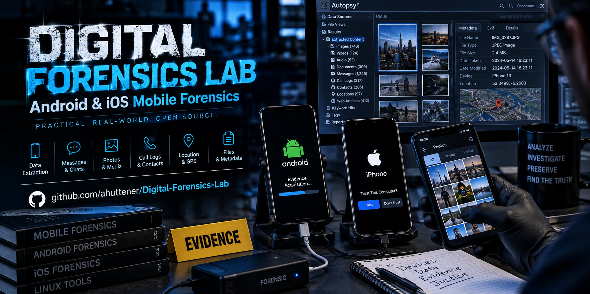
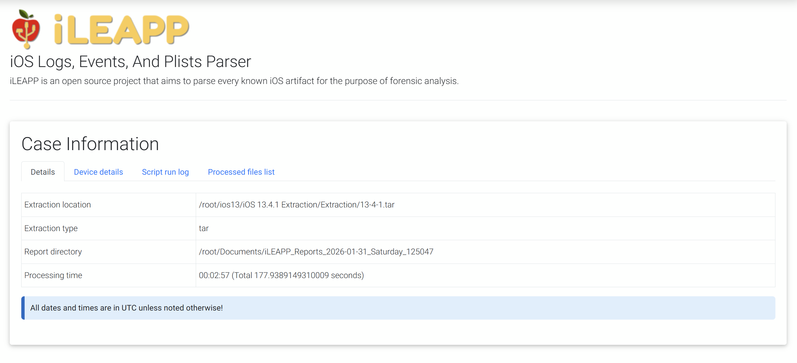
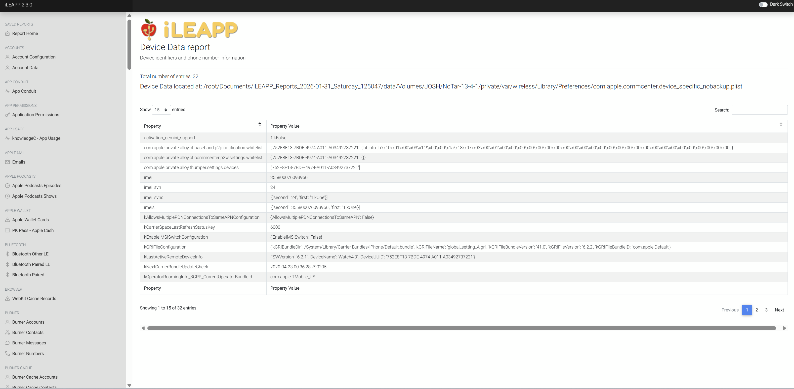
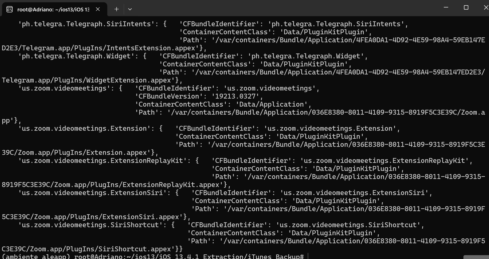
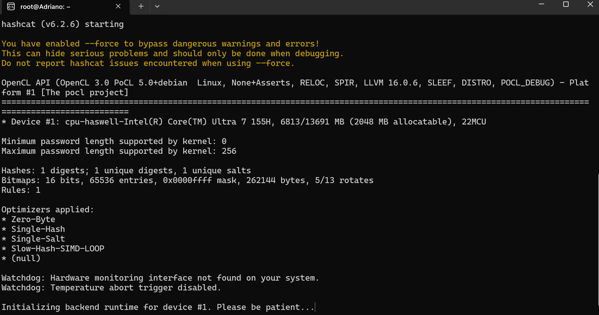
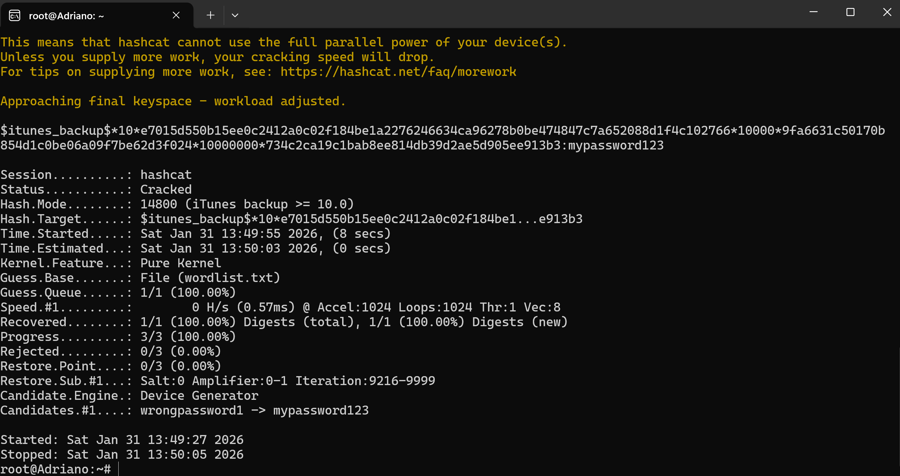

  

  
  
  
  
  
  

  <b>Practical mobile-forensics lab</b> — acquire, extract, and analyse Android &amp; iOS artifacts with open-source tools, documented with the real evidence output at each step.

---

## 👋 About

I'm **Adriano Huttener**, focused on security and digital forensics. This repository is a hands-on walkthrough of mobile-forensics techniques on **public datasets (Digital Corpora)** — acquisition, artifact parsing, encrypted-backup analysis, and password recovery — each step backed by the actual tool output.

> 🇮🇪 Based in Kildare, Ireland · Open to security / forensics roles

---

## 🛠 Environment & tooling

| Area | Stack |
|------|-------|
| **OS** | Ubuntu on WSL (Windows Subsystem for Linux) |
| **Android** | ADB · ALEAPP · `tar` |
| **iOS** | iLEAPP · iOSbackup · iTunes_Backup_Reader |
| **Cracking** | Hashcat (mode 14800) · Perl extractor |
| **Cloud** | pyicloud (proof of concept) |

---

## 🧪 Case walkthrough

### 1 · Android forensic analysis
**Objective:** parse artifacts from an Android 10 image.
- **Tool:** ALEAPP (Android Logs, Events And Protobuf Parser).
- **Outcome:** HTML report with call logs, messages, and app-usage artifacts.

### 2 · Advanced Android extraction (root)
**Objective:** simulate a physical extraction on a rooted device.
- **Method:** shell over `adb`, privilege elevation with `su`, and a manual archive of `/data/data` using `tar`.

### 3 · iOS forensic analysis
**Objective:** parse artifacts from an iPhone (iOS 13.4.1, `iPhone12,8`).
- **Tool:** iLEAPP — parses a `tar` extraction into a browsable case report.
- **Outcome:** device build/OS identification, installed apps, and device-data artifacts (IMEI, carrier, identifiers).

  
   <em>iLEAPP — case information for the iOS 13.4.1 <code>tar</code> extraction.</em>

  
   <em>Device-data report: identifiers, IMEI and carrier artifacts.</em>

### 4 & 5 · Encrypted iTunes backup analysis
**Objective:** access a password-protected iTunes backup.
- **Method:** decrypted the backup with the `iOSbackup` Python library using the known password.
- **Result:** reached internal app containers (Zoom, Telegram).

  
   <em>Decrypted backup — Zoom &amp; Telegram application containers enumerated.</em>

### 6 · Password recovery (brute force)
**Objective:** recover a lost iTunes-backup password.
1. Extracted the hash from `Manifest.plist` with a Perl script → Hashcat **mode 14800**.
2. Ran a dictionary attack against [`tools/wordlist.txt`](tools/wordlist.txt).

  
   <em>Hashcat v6.2.6 initialising against the mode-14800 hash.</em>

  
   <em>Status <b>Cracked</b> — password recovered: <code>mypassword123</code>.</em>

### 7 · Cloud forensics (iCloud) — proof of concept
**Objective:** show a methodology for cloud data acquisition.
- **Method:** a Python script using `pyicloud` to authenticate via API and retrieve location/contact data.
- *Note: proof-of-concept only.*

---

## 🧰 Tools in this repo

| File | Purpose |
|------|---------|
| [`tools/itunes_backup2hashcat.pl`](tools/itunes_backup2hashcat.pl) | Extracts the Hashcat mode-14800 hash from an iTunes backup `Manifest.plist`. Credit: **philsmd** (public domain). |
| [`tools/wordlist.txt`](tools/wordlist.txt) | Small demo wordlist used for the dictionary attack. |

---

## ⚖️ Disclaimer

Conducted **for education and research only**, using **public forensic datasets (Digital Corpora)**. Only acquire or analyse devices and data you own or are **explicitly authorized** to examine.

---

🌐 <a href="https://cybersecinfo.com">cybersecinfo.com</a> · 👤 <a href="https://github.com/ahuttener">github.com/ahuttener</a>

